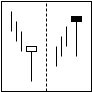

はらみ足 (Inside bar)、抱き線 (Engulfing)
----

<table class="local-table">
  <tr>
    <td></td>
    <td><b>はらみ足 (Inside bar)</b> 
    前の足の実体の範囲（始値〜終値）に、次の足の実体（始値〜終値）がすっぽりと収まるパターンです。
    <strong>相場の転換時</strong>に現れることが多いと言われていますが、頻繁に現れるパターンであり、これだけで相場転換を判断するのは危険です。
    2本のローソク足の組み合わせによって、次のように細かく呼び分けることもあります。
    1) 陰の陽はらみ、2) 陽の陰はらみ、3) 陽の陽はらみ、4) 陰の陰はらみ。
    5分足などの短いインターバルのチャートでは、陽の陽はらみや、陰の陰はらみはほとんど出現しません（前の足の終値と、次の足の始値が飛ぶ形になるため）。
    </td>
  </tr>
  <tr>
    <td></td>
    <td><b>抱き線、つつみ線 (Bullish engulfing)</b> 
    はらみ足の逆のパターンで、後ろの足の実体部分が、前の足の実体部分をすっぽり囲い込む形です。
    陰線をすっぽりと囲む陽線が出た場合は、Bullish engulfing（強気の包み込み）といい、<strong>上昇相場への転換サイン</strong>となります。
    </td>
  </tr>
  <tr>
    <td></td>
    <td><b>Outside bar パターン</b> 
    抱き線の発展形で、最後の足の実体部分が、前の2つの足の実体を両方ともすっぽりと囲む形です。
    図のような形になると、<strong>上昇への転換</strong>を表します。
    5分足などの短いインターバルのチャートでは、このように複数の足の関係を見た方が、だましを排除しやすくなるでしょう。
    </td>
  </tr>
</table>

三川
----

三川はローソク足3本の組み合わせのパターンです。

<table class="local-table">
  <tr>
    <td></td>
    <td><b>三川明けの明星 (Morning star)</b> 
    <strong>底入れ</strong>を示すサインです。
    </td>
  </tr>
  <tr>
    <td></td>
    <td><b>三川宵の明星 (Evening star)</b> 
    <strong>天井</strong>を示すサインです。
    </td>
  </tr>
</table>

三兵
----

三兵はローソク足3本の組み合わせのパターンです。

<table class="local-table">
  <tr>
    <td></td>
    <td><b>赤三兵 (Three white soldiers)</b> 
    安値と高値を切り上げながら3連続する陽線が出現するパターンです。
    底値圏で出れば<strong>上昇転換</strong>のサインとなります。
    </td>
  </tr>
  <tr>
    <td></td>
    <td><b>黒三兵 (Three black crows)</b> 
    高値と安値を切り下げながら3連続する陰線が出現するパターンです。
    天井圏で出れば<strong>下降転換</strong>のサインになります。
    </td>
  </tr>
</table>

カラカサ／トンカチ
----

<table class="local-table">
  <tr>
    <td></td>
    <td><b>カラカサ (Hammer, Hanging man)</b> 
    上昇トレンドや下降トレンドが継続した後に、下に長いヒゲを持つ短い実体が登場するパターンです。
    一般的に、下降トレンドの後に出現するものをハンマー (Hammer) と呼び、<strong>上昇転換</strong>を示唆します。
    逆に、上昇トレンドの後に出現するものをハングマン (Hanging man)（首吊り）と呼び、<strong>上昇相場の終わり</strong>を示唆します。
    </td>
  </tr>
  <tr>
    <td></td>
    <td><b>トンカチ、流れ星 (Shooting Star)</b> 
    上昇相場のピークあたりに現れると<strong>下落の兆し</strong>を示し、下降相場の底値あたりで現れると<strong>上昇の兆し</strong>を示します。日本語でトンカチというと、下に実体のあるこの形ですが、英語で Hammer というと、上に実体のある形（＝カラカサ）を示すことに注意してください。
    </td>
  </tr>
</table>

2デイ・リバーサル
----

<table class="local-table">
  <tr>
    <td></td>
    <td><b>2デイ・リバーサル (上昇転換)</b> 
    前日が大きな下落、当日が大きな上昇となり、前日始値と当日終値が一致するパターンです。底値圏で現れると<strong>上昇転換</strong>のサインとなり、二つのローソクを合わせると同時線になります。同時線が相場の反転を示すと言われる理由です。
    </td>
  </tr>
  <tr>
    <td></td>
    <td><b>2デイ・リバーサル (下降転換)</b> 
    前日が大きな上昇、当日が大きな下落となり、前日始値と当日終値が一致するパターンです。天井圏で現れると<strong>下降転換</strong>のサインとなり、二つのローソクを合わせると同時線になります。同時線が相場の反転を示すと言われる理由です。
    </td>
  </tr>
</table>

